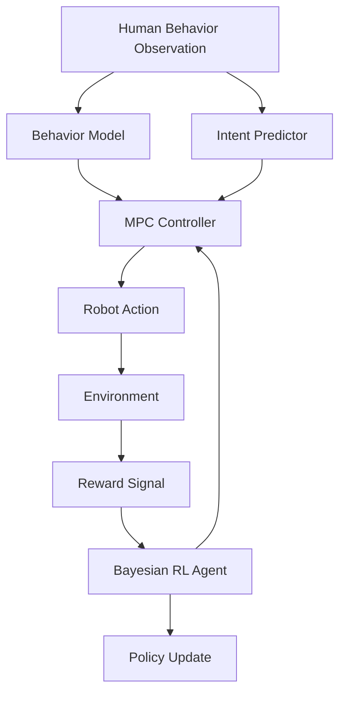

# Model-Based RL for Predictive Human Intent Recognition

A robotic system that models human behavior to anticipate next actions (handovers, gestures) using Model Predictive Control (MPC) combined with Bayesian Reinforcement Learning.

## Overview

This project implements a comprehensive framework for human-robot interaction that:

- **Models human behavior** using machine learning techniques to recognize gestures, predict motions, and infer intentions
- **Predicts human intent** through Bayesian inference methods that quantify uncertainty in predictions  
- **Controls robot actions** using Model Predictive Control to optimize for safety, efficiency, and collaboration
- **Learns optimal policies** through Bayesian Reinforcement Learning that balances exploration and exploitation

## Project Structure

```
project2_human_intent_rl/
├── src/                          # Main source code
│   ├── models/                   # Human behavior and intent prediction models
│   │   ├── human_behavior.py     # Abstract base class for behavior modeling
│   │   └── intent_predictor.py   # Abstract base class for intent prediction
│   ├── controllers/              # Model Predictive Control implementations
│   │   └── mpc_controller.py     # Abstract base class for MPC controllers
│   ├── agents/                   # Bayesian RL agents
│   │   └── bayesian_rl_agent.py  # Abstract base class for Bayesian RL
│   ├── utils/                    # Utility functions and helpers
│   │   └── logger.py             # Logging configuration and utilities
│   └── visualization/            # Plotting and visualization tools
├── tests/                        # Test suite
│   ├── unit/                     # Unit tests
│   ├── integration/              # Integration tests  
│   └── fixtures/                 # Test fixtures and data
├── data/                         # Data storage
├── experiments/                  # Experiment configurations and results
├── docs/                         # Documentation
├── logs/                         # Log files
├── config/                       # Configuration files
└── venv/                         # Virtual environment
```

## Installation

### Prerequisites

- Python 3.8 or higher
- Virtual environment tool (venv, conda, etc.)

### Setup

1. **Clone the repository:**
   ```bash
   cd Model_Based_RL_for_Predictive_Human_Intent_Recognition
   cd project2_human_intent_rl
   ```

2. **Activate virtual environment:**
   ```bash
   source venv/bin/activate  # On Windows: venv\Scripts\activate
   ```

3. **Install dependencies:**
   ```bash
   pip install -r requirements.txt
   ```

4. **Install in development mode:**
   ```bash
   pip install -e .
   ```

5. **Set up environment variables:**
   ```bash
   cp .env.template .env
   # Edit .env with your specific configuration
   ```

## Core Components

### 1. Human Behavior Model (`src/models/human_behavior.py`)

Abstract interface for modeling human behavior patterns:

```python
from src.models.human_behavior import HumanBehaviorModel, HumanState

# Implement your custom behavior model
class MyBehaviorModel(HumanBehaviorModel):
    def predict_behavior(self, current_state, time_horizon):
        # Your implementation here
        pass
```

**Key Features:**
- Gesture recognition and classification
- Motion trajectory prediction  
- Confidence estimation and uncertainty quantification
- Online learning and adaptation

### 2. Intent Predictor (`src/models/intent_predictor.py`)

Abstract interface for predicting human intentions:

```python  
from src.models.intent_predictor import IntentPredictor, IntentType

class MyIntentPredictor(IntentPredictor):
    def predict_intent(self, human_state, context):
        # Your implementation here
        pass
```

**Key Features:**
- Multi-modal intent recognition
- Contextual reasoning with environmental factors
- Uncertainty estimation (aleatoric and epistemic)
- Temporal intent sequence prediction

### 3. MPC Controller (`src/controllers/mpc_controller.py`)

Abstract interface for Model Predictive Control:

```python
from src.controllers.mpc_controller import MPCController, MPCConfiguration

class MyMPCController(MPCController):
    def solve_mpc(self, current_state, human_predictions, intent_predictions, context):
        # Your implementation here
        pass
```

**Key Features:**
- Multi-objective optimization (safety, efficiency, collaboration)
- Constraint handling (collision avoidance, joint limits, workspace bounds)
- Real-time trajectory optimization
- Human-aware motion planning

### 4. Bayesian RL Agent (`src/agents/bayesian_rl_agent.py`)

Abstract interface for Bayesian Reinforcement Learning:

```python
from src.agents.bayesian_rl_agent import BayesianRLAgent, LearningStrategy

class MyBayesianAgent(BayesianRLAgent):
    def get_action(self, state, exploration=True):
        # Your implementation here  
        pass
```

**Key Features:**
- Thompson sampling and upper confidence bounds
- Uncertainty-aware exploration
- Policy parameter distribution maintenance
- Safe learning in human environments

## Usage Examples

### Basic Setup

```python
import numpy as np
from src.utils.logger import setup_logging
from src.models.human_behavior import HumanState

# Setup logging
setup_logging(log_level="INFO", log_file="logs/experiment.log")

# Create a human state observation
human_state = HumanState(
    position=np.array([1.0, 0.5, 1.2]),
    orientation=np.array([1.0, 0.0, 0.0, 0.0]),
    joint_positions={
        'head': np.array([1.0, 0.5, 1.5]),
        'left_hand': np.array([0.8, 0.3, 1.0]),
        'right_hand': np.array([1.2, 0.3, 1.0])
    },
    velocity=np.array([0.1, 0.0, 0.0]),
    timestamp=time.time(),
    confidence=0.95
)
```

### Environment Configuration

Copy `.env.template` to `.env` and customize:

```bash
# Logging
LOG_LEVEL=INFO
LOG_FILE=logs/human_intent_rl.log

# Model Configuration  
BATCH_SIZE=32
LEARNING_RATE=0.001
DEVICE=cpu

# MPC Configuration
MPC_HORIZON=10
MPC_CONTROL_FREQUENCY=50.0

# Safety Configuration
SAFETY_MARGIN=0.1
ROBOT_WORKSPACE_BOUNDS=[-1.0, 1.0, -1.0, 1.0, 0.0, 2.0]
```

## Testing

Run the test suite:

```bash
# Run all tests
pytest

# Run with coverage
pytest --cov=src --cov-report=html

# Run specific test categories
pytest -m unit          # Unit tests only
pytest -m integration   # Integration tests only
pytest -m "not slow"    # Skip slow tests
```

## Development

### Code Style

This project uses:
- **Black** for code formatting
- **Flake8** for linting  
- **MyPy** for type checking

```bash
# Format code
black src tests

# Lint code  
flake8 src tests

# Type checking
mypy src
```

### Type Hints

All code uses comprehensive type hints following PEP 484:

```python
from typing import Dict, List, Optional, Tuple, Any
import numpy as np

def predict_trajectory(
    initial_state: np.ndarray,
    time_horizon: float,
    num_samples: int = 100
) -> Tuple[np.ndarray, float]:
    # Implementation with full type safety
    pass
```

## Architecture



## Contributing

1. Fork the repository
2. Create a feature branch (`git checkout -b feature/amazing-feature`)
3. Make changes following our coding standards
4. Add tests for new functionality
5. Ensure all tests pass (`pytest`)
6. Run code formatting (`black .`)
7. Commit changes (`git commit -m 'Add amazing feature'`)
8. Push to branch (`git push origin feature/amazing-feature`)
9. Open a Pull Request

## License

This project is licensed under the MIT License - see the LICENSE file for details.

## Citation

If you use this work in your research, please cite:

```bibtex
@software{human_intent_rl,
  title={Model-Based RL for Predictive Human Intent Recognition},
  author={Human Intent Recognition Team},
  year={2024},
  url={https://github.com/team/human-intent-rl}
}
```