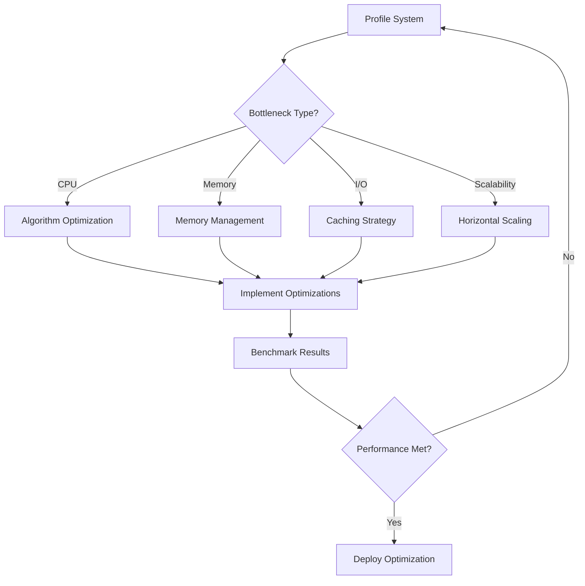

# Performance Optimization Guide
**Model-Based RL Human Intent Recognition System**

**Document Version:** 1.0  
**Date:** January 15, 2025  
**Next Review:** July 15, 2025

---

## Overview

This comprehensive guide provides detailed instructions and best practices for optimizing the performance of the Model-Based RL Human Intent Recognition System. The optimization framework addresses computational bottlenecks, memory management, algorithm efficiency, caching strategies, and scalability considerations to ensure real-time operation in production environments.

**Performance Objectives:**
- Real-time inference: <10ms response time for safety-critical decisions
- High throughput: >1000 predictions per second sustained
- Memory efficiency: <2GB RAM usage under normal operation
- Scalability: Support for 10-100x load increases through horizontal/vertical scaling
- 99.9% availability with graceful degradation under stress

---

## Architecture Overview

### Optimization System Components

```
┌─────────────────────────────────────────────────────────────────┐
│                    Performance Optimization Suite               │
├─────────────────────────────────────────────────────────────────┤
│  ┌─────────────────┐  ┌─────────────────┐  ┌─────────────────┐  │
│  │   System        │  │   Algorithm     │  │   Memory        │  │
│  │   Profiler      │  │   Optimizer     │  │   Manager       │  │
│  │                 │  │                 │  │                 │  │
│  │ • CPU Profiling │  │ • GP Inference  │  │ • Object Pools  │  │
│  │ • Memory Track  │  │ • MPC Solver    │  │ • Circular Buf  │  │
│  │ • GPU Monitor   │  │ • Bayesian RL   │  │ • Compression   │  │
│  │ • I/O Analysis  │  │ • Numba JIT     │  │ • GC Management │  │
│  └─────────────────┘  └─────────────────┘  └─────────────────┘  │
│                                                                 │
│  ┌─────────────────┐  ┌─────────────────┐  ┌─────────────────┐  │
│  │   Caching       │  │   Scalability   │  │   Benchmark     │  │
│  │   System        │  │   Analyzer      │  │   Framework     │  │
│  │                 │  │                 │  │                 │  │
│  │ • LRU Cache     │  │ • Load Testing  │  │ • Regression    │  │
│  │ • Disk Cache    │  │ • Auto Scaling  │  │ • Comparative   │  │
│  │ • Distributed   │  │ • Resource Plan │  │ • Visualization │  │
│  │ • Precompute    │  │ • Cost Analysis │  │ • Reporting     │  │
│  └─────────────────┘  └─────────────────┘  └─────────────────┘  │
└─────────────────────────────────────────────────────────────────┘
```

### Key Performance Metrics

| **Metric** | **Target** | **Critical Threshold** | **Monitoring** |
|------------|------------|------------------------|----------------|
| Response Time (P95) | <10ms | >50ms | Real-time |
| Throughput | >1000 req/s | <500 req/s | Real-time |
| CPU Usage | <70% | >90% | Continuous |
| Memory Usage | <2GB | >4GB | Continuous |
| Cache Hit Rate | >90% | <70% | Periodic |
| Error Rate | <0.1% | >1% | Real-time |

---

## System Profiling and Bottleneck Analysis

### Computational Profiling

#### Setting Up the Profiler

```python
from src.optimization.profiler import SystemProfiler, ProfilerConfig

# Configure comprehensive profiling
config = ProfilerConfig(
    enable_line_profiling=True,
    enable_memory_profiling=True,
    enable_gpu_profiling=True,
    enable_io_profiling=True,
    sampling_interval=0.1
)

profiler = SystemProfiler(config)
```

#### Profiling Critical Functions

```python
# Profile individual functions
@profiler.profile_decorator()
def inference_pipeline(observation, robot_state):
    # Your inference code here
    return prediction

# Profile code blocks
with profiler.profile_context():
    result = expensive_computation()
    
# Get profiling results
result = profiler.stop_profiling()
print(profiler.generate_report(result))
```

#### Interpreting Profiling Results

**CPU Bottlenecks:**
- Functions consuming >10ms execution time
- High call frequency with moderate per-call cost
- CPU usage consistently above 80%

**Memory Bottlenecks:**
- Memory allocations >100MB in single operation
- Memory growth without corresponding deallocation
- Peak memory usage approaching system limits

**I/O Bottlenecks:**
- Disk read/write operations >10MB/s sustained
- Network latency >5ms for local operations
- File system cache misses

### Performance Optimization Workflow



---

## Algorithm Optimization

### Gaussian Process Inference Optimization

#### Kernel Matrix Optimization

```python
from src.optimization.algorithm_optimizer import GPInferenceOptimizer

# Initialize with optimization config
gp_optimizer = GPInferenceOptimizer(config)

# Optimized prediction with caching
mean, variance = gp_optimizer.predict(
    X_train, y_train, X_test, 
    kernel_params={'length_scale': 1.0, 'variance': 1.0}
)
```

**Key Optimizations:**
1. **Numba JIT Compilation:** 5-10x speedup for kernel computations
2. **GPU Acceleration:** 20-50x speedup for large matrices (>1000x1000)
3. **Cholesky Caching:** Reuse decompositions for repeated predictions
4. **Sparse GP Methods:** Use inducing points for datasets >10,000 points

#### Hyperparameter Optimization

```python
# Efficient hyperparameter optimization
optimal_params = gp_optimizer.optimize_hyperparameters(
    X_train, y_train, 
    initial_params={'length_scale': 1.0, 'variance': 1.0}
)
```

### Model Predictive Control (MPC) Optimization

#### Quadratic Programming Solver

```python
from src.optimization.algorithm_optimizer import MPCOptimizer

mpc_optimizer = MPCOptimizer(config)

# Solve MPC problem with warm-starting
result = mpc_optimizer.solve(
    initial_state=current_state,
    reference_trajectory=desired_trajectory,
    horizon=10,
    dt=0.1,
    Q=state_cost_matrix,
    R=control_cost_matrix,
    constraints={'u_min': min_control, 'u_max': max_control}
)
```

**Optimization Techniques:**
1. **Warm Starting:** Use previous solution as initial guess
2. **Sparse Formulation:** Exploit structure in constraint matrices
3. **Parallel Processing:** Solve multiple scenarios simultaneously
4. **Approximation Methods:** Use linear approximations for nonlinear constraints

### Bayesian Reinforcement Learning Optimization

```python
from src.optimization.algorithm_optimizer import BayesianRLOptimizer

bayes_rl = BayesianRLOptimizer(config)

# Optimized acquisition function
action = bayes_rl.optimize_acquisition(
    gp_mean, gp_var, actions, 
    acquisition_type="ucb", beta=2.0
)

# Efficient belief state update
posterior_belief = bayes_rl.update_belief_state(
    prior_belief, observation, action, reward
)
```

**Key Performance Enhancements:**
1. **Thompson Sampling Caching:** Cache posterior samples
2. **Acquisition Function Optimization:** Use gradient-based methods
3. **Particle Filter Optimization:** Parallel particle updates
4. **Importance Sampling:** Reduce particle count while maintaining accuracy

---

## Memory Management and Optimization

### Object Pooling

#### NumPy Array Pooling

```python
from src.optimization.memory_manager import MemoryManager

memory_manager = MemoryManager()

# Use pooled arrays
with memory_manager.temporary_array(shape=(1000, 1000)) as array:
    # Perform computation using pooled array
    result = np.dot(array, array.T)
    
# Array automatically returned to pool
```

#### Custom Object Pools

```python
# Create custom object pool
pool = memory_manager.create_pool(
    name="gp_models",
    factory=lambda: GaussianProcessModel(),
    max_size=50,
    reset_method="reset"
)

# Use pooled objects
model = pool.borrow()
try:
    prediction = model.predict(data)
finally:
    pool.return_object(model)
```

### Memory Monitoring and Garbage Collection

```python
# Enable memory monitoring
stats = memory_manager.get_memory_stats()
if stats.rss_mb > 2000:  # 2GB threshold
    optimization_result = memory_manager.optimize_memory()
    print(f"Memory optimization: {optimization_result}")
```

#### Memory-Mapped Arrays for Large Datasets

```python
# For datasets >1GB
large_dataset = memory_manager.create_memory_mapped_array(
    filepath="large_dataset.dat",
    shape=(100000, 1000),
    dtype=np.float64
)

# Access like regular NumPy array
result = np.mean(large_dataset[10000:20000])
```

### Efficient Data Structures

#### Circular Buffers for Time Series

```python
# Memory-efficient circular buffer
buffer = memory_manager.create_circular_buffer(size=1000)

# Add data without growing memory
for i in range(5000):
    buffer.append(sensor_reading[i])

# Get recent data
recent_data = buffer.get_recent(100)
```

#### Compressed Storage

```python
# Store large objects with compression
memory_manager.store_compressed("model_weights", large_model)
restored_model = memory_manager.retrieve_compressed("model_weights")
```

---

## Caching and Precomputation

### Multi-Level Caching Strategy

```python
from src.optimization.caching_system import CacheSystem, CacheConfig

# Configure caching system
cache_config = CacheConfig(
    max_memory_mb=1000.0,
    max_disk_mb=5000.0,
    enable_distributed=True,
    redis_host="localhost"
)

cache_system = CacheSystem(cache_config)
```

#### Function Result Caching

```python
# Cache expensive function results
@cache_system.cached(ttl=3600)  # 1 hour TTL
def expensive_gp_inference(X_train, y_train, X_test):
    # Expensive GP computation
    return mean, variance

# Automatic caching - subsequent calls with same inputs return cached results
result1 = expensive_gp_inference(X1, y1, X_test)  # Computed
result2 = expensive_gp_inference(X1, y1, X_test)  # Cached - instant return
```

#### Precomputation Engine

```python
# Register functions for precomputation
cache_system.precompute(
    name="gp_predictions",
    func=gp_inference_function,
    input_generator=lambda: generate_common_input_scenarios(),
    batch_size=100
)

# Start background precomputation
cache_system.start_precomputation(num_workers=4)
```

### Cache Performance Optimization

#### Cache Hit Rate Analysis

```python
stats = cache_system.get_statistics()
print(f"Cache hit rate: {stats['global']['hit_rate']:.2%}")

if stats['global']['hit_rate'] < 0.8:
    # Analyze cache miss patterns
    # Adjust cache size or TTL
    # Consider different caching strategies
```

#### Distributed Caching

```python
# For multi-instance deployments
# Cache shared across multiple processes/machines
# Automatic cache invalidation and consistency
cache_system = CacheSystem(CacheConfig(
    enable_distributed=True,
    redis_host="redis-cluster.example.com"
))
```

---

## Scalability and Load Management

### Horizontal Scaling Analysis

```python
from src.optimization.scalability_analyzer import ScalabilityAnalyzer

analyzer = ScalabilityAnalyzer(config)

# Comprehensive scalability analysis
result = analyzer.run_comprehensive_analysis(
    target_function=your_inference_function,
    test_scenarios=[
        {'concurrent_users': 10, 'duration': 60},
        {'concurrent_users': 100, 'duration': 60},
        {'concurrent_users': 1000, 'duration': 60}
    ]
)

# Get scaling recommendations
print(analyzer.generate_scaling_report(result))
```

### Load Testing and Performance Validation

#### Automated Load Testing

```python
# Generate synthetic load
load_results = analyzer.load_generator.generate_load(
    target_function=inference_pipeline,
    concurrent_users=500,
    duration=300  # 5 minutes
)

# Analyze performance under load
metrics = analyzer.horizontal_scaler._calculate_metrics(load_results, 300)
print(f"Throughput: {metrics.throughput:.1f} req/s")
print(f"P95 Response Time: {metrics.response_time_p95:.3f}s")
```

### Auto-Scaling Implementation

```python
# Configure auto-scaling
config.enable_auto_scaling = True
config.min_replicas = 2
config.max_replicas = 20
config.cpu_threshold = 70.0
config.max_response_time = 0.05  # 50ms

auto_scaler = AutoScaler(config)

# Monitor and scale based on metrics
should_scale, reason, new_replicas = auto_scaler.should_scale(current_metrics)
if should_scale:
    auto_scaler.execute_scaling(new_replicas, reason)
```

### Resource Planning and Cost Optimization

```python
# Analyze resource requirements
horizontal_analysis = analyzer.horizontal_scaler.analyze_scaling_requirements(
    current_metrics, target_throughput=2000.0
)

vertical_analysis = analyzer.vertical_scaler.analyze_vertical_scaling(
    current_metrics, target_improvement=2.0
)

print("Scaling Recommendations:")
for rec in horizontal_analysis['recommendations']:
    print(f"  • {rec}")

print(f"Estimated monthly cost: ${result.cost_analysis['total_monthly']:.2f}")
```

---

## Benchmarking and Performance Validation

### Comprehensive Benchmarking Framework

```python
from src.optimization.benchmark_framework import BenchmarkFramework, BenchmarkConfig

# Configure benchmarking
benchmark_config = BenchmarkConfig(
    num_iterations=100,
    warmup_iterations=10,
    enable_regression_testing=True,
    baseline_tolerance_percent=5.0
)

framework = BenchmarkFramework(benchmark_config)
```

#### Setting Performance Baselines

```python
# Benchmark critical functions
summary = framework.benchmark(
    func=gp_inference_function,
    args=(X_train, y_train, X_test),
    name="GP Inference"
)

# Set as baseline for regression testing
framework.set_baseline("GP Inference", summary)
```

#### Regression Testing

```python
# Run benchmarks and check for regressions
benchmarks = [
    {'func': gp_inference, 'name': 'GP Inference'},
    {'func': mpc_solve, 'name': 'MPC Solver'},
    {'func': belief_update, 'name': 'Belief Update'}
]

summaries = framework.benchmark_suite(benchmarks)

# Generate comprehensive reports
output_files = framework.generate_full_report(summaries, "performance_test")

for report_type, filepath in output_files.items():
    print(f"{report_type} report: {filepath}")
```

### Performance Monitoring in Production

#### Real-time Performance Metrics

```python
# Production monitoring setup
with framework.benchmark_context("production_inference") as metrics:
    result = inference_pipeline(observation)
    
    # Add custom metrics
    metrics.add_custom_metric("prediction_confidence", result.confidence)
    metrics.add_custom_metric("safety_margin", result.safety_margin)
```

#### Continuous Performance Validation

```python
# Daily performance regression checks
def daily_performance_check():
    current_summaries = framework.benchmark_suite(critical_benchmarks)
    
    regressions = [
        name for name, summary in current_summaries.items()
        if summary.regression_detected
    ]
    
    if regressions:
        send_alert(f"Performance regressions detected: {regressions}")
    
    return current_summaries
```

---

## Performance Tuning Best Practices

### Code-Level Optimizations

#### Numba JIT Compilation

```python
from numba import jit, njit, prange

# Optimize CPU-intensive loops
@njit(parallel=True, fastmath=True)
def optimized_kernel_computation(X1, X2, length_scale):
    n1, d = X1.shape
    n2 = X2.shape[0]
    K = np.zeros((n1, n2))
    
    for i in prange(n1):
        for j in prange(n2):
            dist_sq = 0.0
            for k in range(d):
                diff = X1[i, k] - X2[j, k]
                dist_sq += diff * diff
            K[i, j] = np.exp(-0.5 * dist_sq / (length_scale * length_scale))
    
    return K
```

#### GPU Acceleration

```python
import torch

def gpu_accelerated_inference(data):
    if torch.cuda.is_available():
        device = torch.device("cuda")
        data_tensor = torch.tensor(data, device=device)
        
        # GPU computation
        result = torch.matmul(data_tensor, data_tensor.T)
        
        return result.cpu().numpy()
    else:
        # CPU fallback
        return np.dot(data, data.T)
```

### System-Level Optimizations

#### Process and Thread Management

```python
# Optimal worker configuration
optimal_workers = min(mp.cpu_count(), 8)  # Cap at 8 for I/O bound tasks
cpu_intensive_workers = mp.cpu_count()    # Use all cores for CPU bound

# Configure process pools
with ProcessPoolExecutor(max_workers=cpu_intensive_workers) as executor:
    futures = [executor.submit(cpu_bound_task, data) for data in dataset]
    results = [future.result() for future in futures]
```

#### Memory Usage Optimization

```python
# Minimize memory fragmentation
gc.set_threshold(700, 10, 10)  # Aggressive garbage collection

# Use memory mapping for large arrays
def process_large_dataset(filepath):
    # Memory map instead of loading into RAM
    data = np.memmap(filepath, dtype=np.float64, mode='r')
    
    # Process in chunks
    chunk_size = 10000
    results = []
    
    for i in range(0, len(data), chunk_size):
        chunk = data[i:i+chunk_size]
        result = process_chunk(chunk)
        results.append(result)
    
    return np.concatenate(results)
```

### Configuration Optimization

#### Environment-Specific Tuning

```python
# Production configuration
PRODUCTION_CONFIG = {
    'num_workers': 16,
    'batch_size': 100,
    'cache_size_mb': 2000,
    'enable_gpu': True,
    'enable_profiling': False,  # Disable in production
    'log_level': 'WARNING'
}

# Development configuration
DEVELOPMENT_CONFIG = {
    'num_workers': 4,
    'batch_size': 10,
    'cache_size_mb': 500,
    'enable_gpu': False,
    'enable_profiling': True,
    'log_level': 'DEBUG'
}
```

#### Dynamic Configuration Adjustment

```python
def adjust_configuration_based_on_load(current_metrics):
    """Dynamically adjust configuration based on current performance."""
    config_updates = {}
    
    if current_metrics.cpu_usage > 80:
        config_updates['num_workers'] = max(1, config_updates.get('num_workers', 8) - 2)
    
    if current_metrics.memory_usage > 1500:  # 1.5GB
        config_updates['cache_size_mb'] = max(100, config_updates.get('cache_size_mb', 1000) - 200)
    
    if current_metrics.response_time_p95 > 0.05:  # 50ms
        config_updates['enable_aggressive_caching'] = True
    
    return config_updates
```

---

## Deployment Performance Optimization

### Container Optimization

#### Docker Configuration

```dockerfile
# Multi-stage build for smaller images
FROM python:3.9-slim as builder
COPY requirements.txt .
RUN pip install --no-cache-dir -r requirements.txt

FROM python:3.9-slim
COPY --from=builder /usr/local/lib/python3.9/site-packages /usr/local/lib/python3.9/site-packages

# Optimize for performance
ENV PYTHONUNBUFFERED=1
ENV PYTHONDONTWRITEBYTECODE=1
ENV OMP_NUM_THREADS=4

# Memory limits
ENV MALLOC_TRIM_THRESHOLD=100000
ENV MALLOC_MMAP_THRESHOLD=100000

COPY . /app
WORKDIR /app

CMD ["python", "-O", "main.py"]
```

#### Kubernetes Resource Optimization

```yaml
apiVersion: apps/v1
kind: Deployment
metadata:
  name: intent-recognition
spec:
  replicas: 3
  template:
    spec:
      containers:
      - name: app
        image: intent-recognition:latest
        resources:
          requests:
            memory: "1Gi"
            cpu: "500m"
          limits:
            memory: "2Gi"
            cpu: "1000m"
        env:
        - name: OMP_NUM_THREADS
          value: "4"
        - name: PYTHONUNBUFFERED
          value: "1"
```

### Production Monitoring

#### Performance Metrics Collection

```python
import prometheus_client

# Define metrics
INFERENCE_TIME = prometheus_client.Histogram(
    'inference_duration_seconds',
    'Time spent on inference',
    buckets=[0.001, 0.005, 0.01, 0.05, 0.1, 0.5, 1.0]
)

CACHE_HIT_RATE = prometheus_client.Gauge(
    'cache_hit_rate',
    'Cache hit rate percentage'
)

@INFERENCE_TIME.time()
def monitored_inference(observation):
    result = inference_pipeline(observation)
    
    # Update metrics
    CACHE_HIT_RATE.set(cache_system.get_statistics()['global']['hit_rate'])
    
    return result
```

#### Alerting Configuration

```python
# Performance alerting thresholds
PERFORMANCE_ALERTS = {
    'response_time_p95': {'threshold': 0.05, 'severity': 'warning'},
    'response_time_p99': {'threshold': 0.1, 'severity': 'critical'},
    'error_rate': {'threshold': 0.01, 'severity': 'warning'},
    'memory_usage': {'threshold': 0.8, 'severity': 'warning'},
    'cpu_usage': {'threshold': 0.85, 'severity': 'warning'},
    'cache_hit_rate': {'threshold': 0.8, 'severity': 'warning', 'direction': 'below'}
}
```

---

## Troubleshooting Performance Issues

### Common Performance Problems and Solutions

#### High Response Time

**Symptoms:**
- P95 response time >50ms
- Increased queue lengths
- User complaints about system responsiveness

**Diagnosis:**
```python
# Profile the critical path
with profiler.profile_context("response_time_investigation"):
    result = full_inference_pipeline(observation)

report = profiler.generate_report()
# Look for functions taking >10ms
```

**Solutions:**
1. **Implement caching** for frequently accessed predictions
2. **Optimize algorithms** using Numba JIT or GPU acceleration
3. **Reduce model complexity** if accuracy permits
4. **Add horizontal scaling** for increased capacity

#### Memory Leaks

**Symptoms:**
- Memory usage continuously increasing
- Periodic out-of-memory errors
- System performance degradation over time

**Diagnosis:**
```python
# Enable memory tracking
memory_manager.monitor.start_monitoring()

# Run workload
for i in range(1000):
    result = inference_function(test_data[i])

# Analyze memory growth
leaks = memory_manager.gc_manager.analyze_memory_leaks()
print("Potential leaks:", leaks)
```

**Solutions:**
1. **Fix unclosed resources** (files, network connections)
2. **Clear circular references** in object graphs  
3. **Implement proper cleanup** in exception handlers
4. **Use weak references** for caches and callbacks

#### CPU Bottlenecks

**Symptoms:**
- CPU usage consistently >90%
- Thread contention and lock waiting
- Poor scaling with additional cores

**Diagnosis:**
```python
# Profile CPU usage
line_stats = profiler.line_profiler.stop_profiling()
cpu_bottlenecks = profiler.analyzer.analyze_cpu_bottlenecks(line_stats)
```

**Solutions:**
1. **Optimize hot code paths** with Numba or Cython
2. **Implement parallel processing** for independent computations
3. **Use vectorized operations** instead of loops
4. **Consider algorithmic improvements** (better complexity)

### Performance Testing Checklist

#### Pre-Deployment Testing

- [ ] **Load Testing**: System handles 2x expected load
- [ ] **Stress Testing**: Graceful degradation under extreme load  
- [ ] **Endurance Testing**: Stable performance over 24+ hours
- [ ] **Resource Testing**: Memory/CPU usage within limits
- [ ] **Regression Testing**: No performance degradation vs baseline

#### Production Monitoring

- [ ] **Real-time Metrics**: Response time, throughput, error rate
- [ ] **Resource Monitoring**: CPU, memory, disk, network usage
- [ ] **Cache Monitoring**: Hit rates, eviction rates, storage usage
- [ ] **Alert Configuration**: Automated alerts for threshold breaches
- [ ] **Performance Reports**: Daily/weekly performance summaries

---

## Performance Optimization Roadmap

### Phase 1: Foundation (Weeks 1-2)
- [ ] Implement comprehensive profiling
- [ ] Set up benchmarking framework
- [ ] Establish performance baselines
- [ ] Configure basic memory management

### Phase 2: Algorithm Optimization (Weeks 3-4)
- [ ] Optimize GP inference with Numba/GPU
- [ ] Implement efficient MPC solver
- [ ] Enhance Bayesian RL components  
- [ ] Add result caching system

### Phase 3: Scalability (Weeks 5-6)
- [ ] Implement horizontal scaling analysis
- [ ] Add load testing capabilities
- [ ] Configure auto-scaling mechanisms
- [ ] Optimize for distributed deployment

### Phase 4: Production Readiness (Weeks 7-8)
- [ ] Production monitoring setup
- [ ] Performance regression testing
- [ ] Documentation and training
- [ ] Performance validation and sign-off

---

## Conclusion

This performance optimization guide provides a comprehensive framework for achieving real-time performance requirements in the Model-Based RL Human Intent Recognition System. By systematically applying profiling, algorithm optimization, memory management, caching, and scalability techniques, the system can maintain sub-10ms response times while handling high throughput loads.

**Key Success Factors:**
- **Continuous Monitoring**: Real-time performance metrics and alerting
- **Systematic Optimization**: Profile-guided optimization decisions
- **Scalable Architecture**: Horizontal and vertical scaling capabilities
- **Regression Prevention**: Automated performance testing in CI/CD
- **Proactive Management**: Regular performance reviews and optimizations

Regular performance reviews should be conducted monthly to identify new optimization opportunities and ensure the system continues to meet performance requirements as it evolves.

---

**Document Control:**
- **Prepared by:** Performance Engineering Team
- **Reviewed by:** Technical Architecture Team  
- **Approved by:** Engineering Manager
- **Next Review Date:** July 15, 2025

**Revision History:**
- Version 1.0 (2025-01-15): Initial performance optimization guide

*This guide should be updated whenever significant performance optimizations are implemented or performance requirements change.*